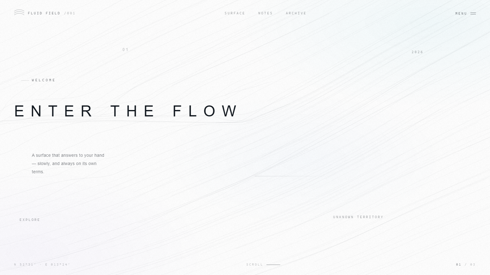
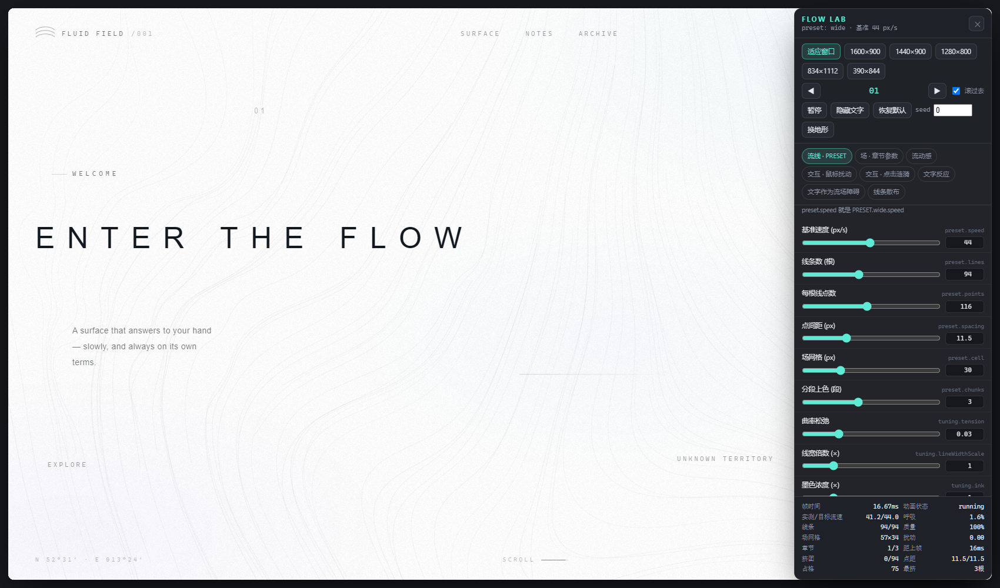
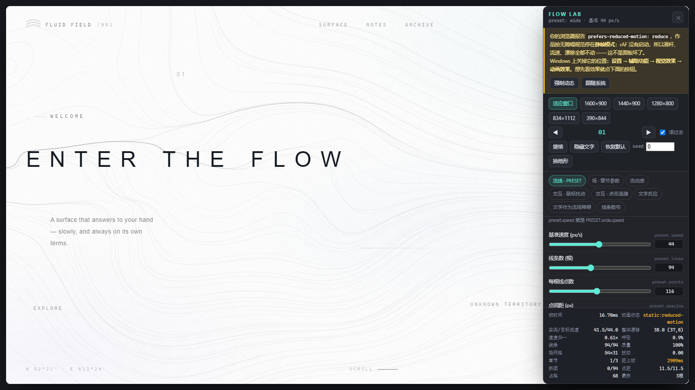
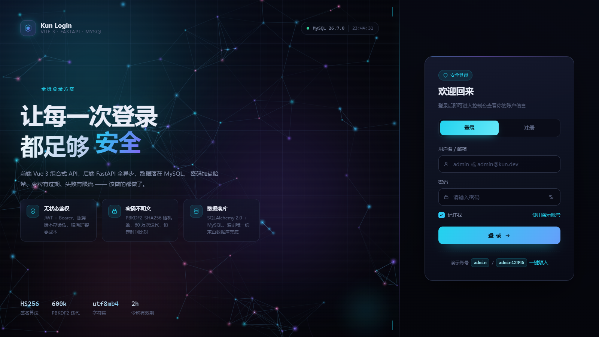

# Kun Login

一个 Vue 3 + FastAPI + MySQL 的全栈示例，包含两块东西：

| | 内容 | 位置 |
|---|---|---|
| **首页** | 交互式数字作品 **ENTER THE FLOW** —— 流线场、等高线、可触碰的水面 | [frontend/public/home/](frontend/public/home/index.html) · [技术说明](docs/flow-home.md) |
| **登录** | 左 2/3 粒子视觉 + 右 1/3 登录 UI，接 FastAPI + MySQL | [frontend/src/](frontend/src/views/LoginView.vue) · [backend/](backend/app/main.py) |

---

## 首页：ENTER THE FLOW

纯白纸上 94 根发丝般的流线，缓慢地穿过整个画面。鼠标划过去像手掠过水面——
扰动先影响近处的线，再一点点「泡」到远处；手离开后场约 4 秒慢慢忘记。
滚动会换掉整个场的方向、疏密与色温，像进入另一个空间。



**零依赖、零构建**：三个文件，双击就能跑。
开发服务器下访问 <http://127.0.0.1:5173/home/index.html>。

### 调参台

<http://127.0.0.1:5173/home/lab.html> —— **首页上没有任何入口**，改地址栏进。



- 作品原样跑在同源 iframe 里，面板只是套在外面。**不复制一份 HTML**，
  所以不会出现「改了首页忘了改测试页」。
- 面板本身不认识任何参数：它从 `window.__flow.lab.spec()` 读出
  「有哪些参数、范围多少、当前值多少」自动生成 UI。
  **往 main.js 的 `LAB_SPEC` 里加一行，面板就自动多一根滑杆。**
- 34 根滑杆分 7 组：`PRESET`（含你要的 `preset.speed`）、章节参数、鼠标扰动、
  点击涟漪、文字反应、文字障碍、线条散布。
- 底部实时显示帧时间、线条数、场网格、**挤团的线**、**点间距** —— 
  调参时能立刻看出有没有把流场调坏。
- 视口预设（1600×900 / 390×844 / …）可以直接测响应式，窄视口会自动切到 narrow 预设。
- 「导出 JSON」拿走当前参数；贴回来点「应用」即可还原。

> 这一页的验证脚本也证明了滑杆**真的驱动了作品**，而不是只改了个数字：
> 把 `preset.speed` 拖到 0，画布逐像素**完全静止**（changedPixels = 0）；
> 拖到 60，16.7% 的像素在动。

> **⚠ 如果你的调参台里所有指标都冻住、滑杆怎么拖都没反应** ——
> 大概率不是坏了，而是你的系统开着「减少动态效果」。Windows 的位置：
> **设置 → 辅助功能 → 视觉效果 → 动画效果**。关掉它 Chrome 会报
> `prefers-reduced-motion: reduce`，作品就按无障碍规范进静帧，
> `requestAnimationFrame` 根本不启动。
>
> 调参台顶部会明确显示这个状态和原因，并提供 **强制动态** 按钮；
> 也可以直接在地址栏加 `?motion=full`。
>
> 

技术要点（完整说明见 [docs/flow-home.md](docs/flow-home.md)）：

- 速度场是 `scale·f(ψ)·curl(ψ) + 常量`，**每一项都严格无散度**——
  面积守恒，所以流线既不会堆成黑块，也不会慢慢汇成几条深色河道
- 鼠标速度被**写进场网格**，靠拉普拉斯扩散往外传播、指数衰减回静息——
  远处的延迟响应是真实物理，不是加的 delay
- 流线用「平流 + 曲率松弛 + 弧长重采样」：重采样是**投影**不是施力，
  所以点永远等间距、曲线永远顺滑（实测 60 秒后「点堆积」为 0）
- 文字是软障碍，流线在它附近折射绕行；标题字符会被光标推开并横向拉伸，松手后缓慢回弹
- **基准流速 44px/s**（章节 44/51/38），每根线另有 0.72~1.28 的速度系数互相错开
- 流场是**低频大尺度**的：主弯层波长约 3400px，高频层只占 6% 的梯度能量
- **主流强度 1.55×旋度** —— 方向偏离主方向最多 ±33°，相邻线基本平行（方向差 4.5~8.4°）
- 净漂移 **40.8px/s**（场速度的空间矢量均值），线条明确从一侧流向另一侧
- **最大折角 5.3~9.6°/段、最小弯曲半径 69~124px** —— 没有发卡弯，不会变成毛发
- 三个不可通约周期（约 30/47/72 秒）叠加出 ±5% 的「呼吸」，听不出机械节拍
- 鼠标是「手划过水面」：沿向拖水 + 垂直漩涡 + 向外推开，留下 1~2 秒的惯性尾迹
- 桌面 94 根线 / 移动 38 根；实测两端都锁满 60fps，自适应降级始终停在最高档

<sub>交互：[鼠标划过](docs/flow-stroke.png) · [光标停在标题上](docs/flow-hover.png) ·
[第二章](docs/flow-chapter-02.png) · [MENU](docs/flow-menu.png) · [移动端](docs/flow-mobile.png)
· 几何稳定性：[3 秒](docs/flow-geometry-3s.png) / [60 秒](docs/flow-geometry-60s.png)
· 动感条：[打开后 2.4 秒内的三帧](docs/flow-motion-strip.png)</sub>

---

## 登录页

桌面端 **左 2/3 炫酷视觉 + 右 1/3 登录界面**，窄屏自动变成「上方视觉条 + 下方登录卡片」。



<sub>窄屏会变成「上方视觉条 + 下方登录卡片」：[移动端](docs/login-mobile.png) ·
登录后：[控制台](docs/dashboard.png)</sub>

---

## 目录结构

```
kun-login/
├─ frontend/                     Vue 3 + Vite
│  ├─ public/home/               ★ ENTER THE FLOW（纯静态，零依赖）
│  │  ├─ index.html
│  │  ├─ styles.css
│  │  ├─ main.js                 流场 / 流线 / 交互 全在这里
│  │  ├─ lab.html                调参台（改地址栏进，首页无入口）
│  │  ├─ lab.css
│  │  └─ lab.js
│  ├─ src/
│  │  ├─ api/client.js           fetch 封装，统一错误文案
│  │  ├─ stores/auth.js          Pinia：token / 用户 / 登录注册登出
│  │  ├─ router/index.js         路由 + 登录守卫
│  │  ├─ components/
│  │  │  ├─ ParticleField.vue    左侧粒子星链（Canvas 2D）
│  │  │  ├─ BrandPanel.vue       左侧品牌文案 / 指标 / 光环
│  │  │  └─ LoginCard.vue        右侧登录注册卡片
│  │  └─ views/
│  │     ├─ LoginView.vue        2fr : 1fr 布局外壳
│  │     └─ DashboardView.vue    登录后的控制台
│  └─ vite.config.js             /api 反代到 8000
│
├─ backend/                      FastAPI
│  ├─ app/
│  │  ├─ config.py               pydantic-settings 读 .env
│  │  ├─ database.py             SQLAlchemy 引擎 / 会话
│  │  ├─ models.py               users 表
│  │  ├─ schemas.py              请求响应模型 + 校验规则
│  │  ├─ security.py             PBKDF2 哈希 + JWT
│  │  ├─ deps.py                 Bearer 鉴权依赖
│  │  ├─ routers/auth.py         注册 / 登录 / me / 登出（含限流）
│  │  └─ main.py                 应用入口
│  ├─ scripts/init_db.py         建表 + 演示账号
│  ├─ sql/schema.sql             从线上库导出的参考 DDL
│  └─ requirements.txt
│
├─ tools/
│  ├─ setup.ps1                  一键初始化
│  ├─ start-mysql.ps1            项目自带的 MySQL 实例（3307）
│  ├─ stop-mysql.ps1
│  ├─ start-backend.ps1
│  ├─ start-frontend.ps1
│  ├─ *.cmd                      同名 .ps1 的包装器（绕过执行策略限制）
│  ├─ mysql/my.ini               MySQL 实例配置
│  └─ verify/
│     ├─ cdp.mjs                 共用的 CDP 客户端（零依赖）
│     ├─ browser-check.mjs       登录页端到端验证
│     └─ home-check.mjs          首页端到端验证（含流体物理断言）
│
├─ setup.cmd / start-all.cmd / stop-all.cmd
├─ start-all.ps1 / stop-all.ps1  一键起停
└─ artifacts/                    验证截图与报告
```

---

## 快速开始

前置：**Python 3.11+**、**Node.js 20+**、**MySQL 8.0+**（本机装过 MySQL Server 就行，不用配成 Windows 服务）。

```powershell
cd D:\KunHome\kun-login

# 1) 一键初始化：起 MySQL 实例、建库建号、装依赖、生成 .env、建表灌演示账号
.\setup.cmd

# 2) 开两个终端
.\tools\start-backend.cmd     # http://127.0.0.1:8000  (文档 /docs)
.\tools\start-frontend.cmd    # http://127.0.0.1:5173
```

浏览器打开 <http://127.0.0.1:5173>，用演示账号登录：

| 用户名 | 密码 |
| --- | --- |
| `admin` | `admin12345` |

也可以直接 `.\start-all.cmd` 一把全拉起来（后台运行，约 9 秒返回），`.\stop-all.cmd` 停止。

> **为什么要用 `.cmd` 而不是 `.ps1`？**
> 这台机器的 PowerShell 执行策略是 `Restricted`，直接跑 `.ps1` 会报
> 「因为在此系统上禁止运行脚本」。`.cmd` 包装器内部用
> `powershell -ExecutionPolicy Bypass -File` 调用同名脚本，把参数原样透传。
> 想直接跑 `.ps1` 的话，先执行一次
> `Set-ExecutionPolicy -Scope CurrentUser RemoteSigned`。

> **`.ps1` 一律存成 UTF-8 with BOM。**
> Windows PowerShell 5.1 对无 BOM 的文件会按系统 ANSI（中文机器上是 GBK）解码，
> 中文字符串会变乱码并截断引号，直接是语法错误。`pwsh` 7 没这个问题，
> 但为了兼容 5.1 就统一带 BOM。

> MySQL 装在别处就用 `.\setup.cmd -MySqlHome 'E:\MySQL'`；
> root 有密码就加 `-MySqlRootPassword 'xxxx'`。

---

## 登录页设计

### 左 2/3 —— 视觉区

| 图层 | 实现 |
| --- | --- |
| 极光背景 | 三个巨大的径向渐变光斑，`filter: blur(96px)` + 关键帧漂移 |
| 粒子星链 | `ParticleField.vue`，Canvas 2D |
| 网格 / 暗角 | `repeating-linear-gradient` 网格 + 径向暗角，把视线压到中心 |
| 内容层 | 品牌、标题、三张特性卡、底部指标 |
| 装饰 | 四角框线、右下旋转光环 |

粒子星链做了这些事：

- 粒子按面积自适应数量（上限 150），`devicePixelRatio` 渲染不发虚；
- 距离越近连线越亮，按亮度分 **6 个桶批量描边**，把几千次 `stroke()` 压到 6 次；
- 鼠标是引力井：附近粒子被推开，同时向光标拉出亮线，整层还有轻微视差；
- 每 4~7 秒随机位置炸一圈冲击波，把波带上的粒子往外推；
- 标签页切到后台暂停 `requestAnimationFrame`；
- 系统开启「减少动态效果」时只画一帧静态图。

标题里的关键词轮播用了 4 个绝对定位的 `<span>`，各自错开 25% 的动画相位。
淡出安排在自身周期的 25%→27%，下一个词的淡入安排在它的 0%→2% ——
两段时间完全重合，任意时刻透明度之和都约等于 1，既不会出现空档也不会长时间重影。

### 右 1/3 —— 登录区

玻璃拟态卡片：顶部流动光带、登录/注册滑块切换、图标输入框、
密码显隐切换、大写锁定提示、「记住我」自定义勾选框、
错误/成功提示条、带 loading 的提交按钮、演示账号一键填入。

浏览器原生校验被关掉（`novalidate`），改用与后端一致的规则做前端校验，
提交时把焦点送到第一个出错的输入框。

### 响应式

| 断点 | 行为 |
| --- | --- |
| ≥ 1600px | 严格 2fr : 1fr，全部内容可见 |
| 1024–1599px | 仍是 2:1，特性卡收成单列 |
| < 1024px | 变成上下结构，视觉区压缩成 27vh 的顶部条，登录卡片占满剩余空间 |

---

## 后端

### 接口

| 方法 | 路径 | 说明 |
| --- | --- | --- |
| `GET` | `/api/health` | 服务 + 数据库连通性自检（登录页右上角状态灯用的就是它） |
| `POST` | `/api/auth/register` | 注册，成功直接返回 token |
| `POST` | `/api/auth/login` | 用户名**或**邮箱 + 密码，返回 JWT |
| `GET` | `/api/auth/me` | 用 Bearer token 换当前用户 |
| `POST` | `/api/auth/logout` | 登出（JWT 无状态，前端丢 token 即可） |

```powershell
# 登录
curl.exe -s -X POST http://127.0.0.1:8000/api/auth/login `
  -H 'Content-Type: application/json' `
  -d '{\"account\":\"admin\",\"password\":\"admin12345\"}'
```

### 安全上做了什么

- **密码不落明文**：`pbkdf2_sha256`，16 字节随机盐、60 万次迭代，
  存成 `pbkdf2_sha256$600000$<salt>$<digest>`；比对用 `hmac.compare_digest` 恒定时间。
  刻意只用标准库，省掉 `bcrypt`/`argon2` 这类需要编译的原生依赖。
- **JWT**：HS256，带 `iat`/`exp`/`typ`，默认 2 小时过期；密钥从 `.env` 读，代码里没有默认可用值。
- **防账号枚举**：用户不存在和密码错误返回同一条「用户名或密码不正确」。
- **登录限流**：同一 `IP + 账号` 连续失败 5 次锁定 5 分钟，返回 429 + `Retry-After`。
- **唯一约束交给数据库**：`username` / `email` 都有唯一索引，并发注册不会写出重复数据。
- **CORS 白名单**：只放行 `.env` 里列出的前端地址。
- **错误兜底**：未捕获异常统一处理，生产环境（`APP_ENV=production`）不把堆栈丢给前端。

### 数据库

`users` 表（完整 DDL 见 [backend/sql/schema.sql](backend/sql/schema.sql)）：

| 字段 | 类型 | 说明 |
| --- | --- | --- |
| `id` | int PK AI | |
| `username` | varchar(32) UNIQUE | 字母开头，3-32 位 |
| `email` | varchar(190) UNIQUE | |
| `password_hash` | varchar(255) | 见上 |
| `display_name` | varchar(64) | |
| `avatar_hue` | int | 由用户名 sha256 派生的稳定色相，前端据此画头像渐变 |
| `is_active` / `is_superuser` | tinyint(1) | |
| `created_at` / `last_login_at` | datetime | |

开发期用 `Base.metadata.create_all()` 建表；上生产请换 Alembic 迁移。

---

## 配置

`backend/.env`（由 `.env.example` 生成，已被 `.gitignore` 排除）：

```ini
APP_ENV=development
DEBUG=true

DB_HOST=127.0.0.1
DB_PORT=3307
DB_USER=kun
DB_PASSWORD=kun_dev_2026
DB_NAME=kun_login

SECRET_KEY=<setup.ps1 生成的随机串>
ACCESS_TOKEN_EXPIRE_MINUTES=120

CORS_ORIGINS=http://localhost:5173,http://127.0.0.1:5173
LOGIN_MAX_ATTEMPTS=5
LOGIN_LOCK_SECONDS=300
```

### 关于 3307 端口

不改动你机器上已有的 MySQL：项目用 `tools/mysql/my.ini` 在工作区里
（`.mysql/data`）跑**独立实例**，监听 **3307**，系统服务 `MySQL6767` 保持原样。
想换回 3306，改 `my.ini` 的 `port` 和 `.env` 的 `DB_PORT` 即可。

> `my.ini` 里**不能**开 `skip-name-resolve`：初始化只建 `root@localhost`，
> 关掉名称解析后 `127.0.0.1` 就匹配不上，会报 `ERROR 1130`。

---

## 验证

两个脚本都走 Chrome DevTools Protocol（Node 内置 WebSocket，零依赖），
共用 [tools/verify/cdp.mjs](kun-login/tools/verify/cdp.mjs)，
都是**真实浏览器 + 真实鼠标事件**，不是 mock。

```powershell
node tools\verify\home-check.mjs         # 首页：19 项断言（视觉/交互/滚动/菜单）
node tools\verify\motion-check.mjs       # 首页：13 项「流动感」客观验收
node tools\verify\motion-override-check.mjs  # 首页：13 项「减少动态效果」场景验证
node tools\verify\field-curvature-probe.mjs  # 场固有曲率 vs 线条实际折角（分离问题）
node tools\verify\alignment-probe.mjs        # 线条切线 vs 场方向的夹角，附最脱轨现场
node tools\verify\geometry-check.mjs     # 首页：流线几何随时间是否退化
node tools\verify\background-check.mjs   # 首页：背景到底是不是静态的
node tools\verify\lab-check.mjs          # 调参台：14 项断言（滑杆是否真的生效）
node tools\verify\browser-check.mjs      # 登录页：9 项断言
```

### 首页 · ENTER THE FLOW

流体那几项不是「看起来动了」，而是直接测物理量：

| 检查 | 实测 |
| --- | --- |
| 划线前 → 刚划完（近处 55px） | 0.049 → **35.03** |
| 划线前 → 刚划完（240px 外，从未被触碰） | 0.013 → **3.81**（涨 295 倍） |
| 能量剖面 `远/近`，1.7 秒内 | 0.109 → **0.879**（扩散特征） |
| 8.2 秒后 | 0.005 / 0.005（回到静息） |
| 文字位移 / 拉伸 / 回弹 | 光标两侧 −11.1px 与 +9.7px、scaleX 1.215、3.2 秒后**完全归零** |
| 滚动换场 | 旋转 0→−0.86rad、频率 ×1.2、色温 0.12→1.00、密度 1.00→0.83，读数 03 |
| 移动端 390×844 | 线条 94 → **38**，仍锁 60fps |
| reduced motion | 出一张**沿场积分**的静帧（不是直线），覆盖率 7.6% |
| MENU | 真实鼠标点击能开能关，且按钮**未被覆盖层挡住**（`elementFromPoint` 命中自己） |
| 控制台 | **0 error / 0 warning / 0 未捕获异常** |

### 登录页

| 检查 | 结果 |
| --- | --- |
| 左/右两栏宽度比 | 1067 : 533 = **2.000** |
| 粒子画布尺寸 | 1067×900，已实际绘制像素 |
| 标题关键词轮播 | 4 个词，采样 5.2s 最低透明度和 = **1.0**（无空档） |
| 真实提交登录 | 跳转 `/dashboard`，读到 `管理员` / `admin@kun.dev` / MySQL 26.7.0 |
| 错误密码 | 停在 `/login`，提示「用户名或密码不正确」 |
| 移动端 414×896 | 上方视觉 414×242 + 下方卡片 414×654 |
| 减少动态效果降级 | 静态显示「安全」，画布仍有内容 |
| 控制台 | **0 error / 0 warning / 0 未捕获异常** |

截图与 JSON 报告落在 `artifacts/`。

> 无头浏览器的默认偏好是 `prefers-reduced-motion: reduce`，脚本会先
> `Emulation.setEmulatedMedia` 覆盖成 `no-preference`，否则拍到的是静态降级版。

---

## 踩过的坑

1. **`tempfile.mkdtemp` 在受限沙箱里建出的目录写不进去**
   Windows 上 CPython 会把 `0o700` 落成「只有属主」的 DACL，而受限进程用的是
   能力 SID 而非属主 SID，于是 `pip` 一解包就 `PermissionError`。
   [tools/pyfix/sitecustomize.py](tools/pyfix/sitecustomize.py) 把 `mkdtemp` 改成
   用继承父目录权限的方式建目录；只在受限环境构建时挂到 `PYTHONPATH`，应用本身不加载。

2. **`pydantic-settings` 会把 `list[str]` 字段当 JSON 解析**
   `.env` 里写 `CORS_ORIGINS=a,b` 会在字段校验器跑之前就 `JSONDecodeError`。
   正确做法是给字段打上 `Annotated[list[str], NoDecode]`。

3. **`localStorage` 不能出现在模板里**
   `{{ localStorage.getItem(...) }}` 会抛 `TypeError`，整页渲染崩掉。
   必须先在 `setup` 里用 `computed` 算好。

4. **无头浏览器的默认偏好是 reduced motion**
   全局 `@media (prefers-reduced-motion: reduce)` 把动画压成 0.001ms 后，
   轮播文字停在 `opacity: 0` 的基础样式上，看上去就是"坏了"。
   既要给 reduced motion 写专门的静态规则，验证时也要记得覆盖媒体特性。

5. **`.ps1` 存成 UTF-8 无 BOM，PowerShell 5.1 会乱码**
   5.1 对无 BOM 文件按系统 ANSI 解码，中文字符串被截断成语法错误。
   统一用 `[System.IO.File]::WriteAllText($path, $text, (New-Object System.Text.UTF8Encoding($true)))` 落盘。

6. **`$home` 是 PowerShell 只读自动变量**
   `foreach ($home in $candidates)` 会直接报「无法覆盖变量 HOME，因为该变量为只读」。
   同理还踩了 `$args`（带 `param` 的脚本里不该覆写）。脚本里的局部变量一律换名。

7. **PS 5.1 的 `Start-Process` 在 `NO_PROXY` / `no_proxy` 并存时会崩**
   报「已添加项。字典中的关键字:"NO_PROXY"所添加的关键字:"no_proxy"」——
   它内部用大小写不敏感的字典复制环境变量。改成直接在 .NET 里
   `[System.Diagnostics.Process]::Start($info)`。

8. **PS 5.1 里 `$info.EnvironmentVariables['X'] = 'Y'` 首次访问就赋值会报「无法对 Null 数组进行索引」**
   这个 `StringDictionary` 是惰性的，必须先读一次才会实例化。
   干脆不用它，需要的环境变量让 `cmd` 自己 `set`。

9. **子进程会攥着调用方的管道不放**
   `UseShellExecute = $false` 时子进程继承父进程的标准句柄，从管道里调用脚本
   会一直不返回（父进程跑完了，管道却因为孙进程还开着而不关闭）。
   `UseShellExecute = $true` + `WindowStyle = 'Hidden'` 既能让子进程拿到自己的
   句柄，又不弹窗，重定向照样能用。

10. **覆盖层打开后，被盖住的按钮就点不到了**
    `.menu` 是 `z-index: 4`，`.topbar` 原本是 `3` —— 菜单一开就把右上角的
   CLOSE 按钮盖住，只能靠 Esc 关。把顶栏提到 `z-index: 5` 解决。

11. **`element.click()` 绕过命中检测，测不出「点不到」**
    菜单那个 bug 之所以没被测出来，就是因为验证脚本用了
    `document.getElementById('menuToggle').click()` —— 它直接派发事件，
    元素被遮住照样成功。改成用真实鼠标事件点按钮坐标，
    并断言 `elementFromPoint(按钮中心)` 命中的还是按钮自己。

12. **`getBoundingClientRect()` 会把 transform 算进去**
    想用「字符当前位置 vs 光标」算推力，如果直接量，量到的是**已经被推开之后**
    的位置，形成正反馈把字越推越远。必须先清空 transform、强制样式刷新、
    量完再恢复（只在 resize 时做）。

13. **鼠标停住时 `inf == 上一帧`，会被「快进慢出」的判据误判成离开**
    原本写成 `inf > prev ? 快 : 慢`，光标一停下就切到慢速率，效果永远到不了位。
    判据应该是「当前有没有影响」，不是「影响有没有在变大」。

14. **JS 里局部变量叫 `path` 会和 `node:path` 的导入撞上 TDZ**
    `const path = []` 写在函数后半段，会让整个函数作用域里的 `path` 进入暂时性死区，
    连前面的 `path.join()` 都报 `Cannot access 'path' before initialization`。

15. **归一化会毁掉无散度 —— 这是这轮最贵的一个错**
    流场的无散度是「画面不会慢慢空掉、也不会汇成几条深色河道」的数学保证。
    我原本写的是 `normalize(curl ψ)`：归一化不改变流线的**几何**，
    但会改变**散度**，`div(g/|g|) ≠ 0`，于是流线开始缓慢汇聚，
    94 根线占用的 120px 格子从 76 塌到 46、最挤的一格挤了 11 根。
    同一类错误犯了三次（归一化、混入随空间变化的方向场、用普通噪声调速度），
    最后收敛到：`v = scale·f(ψ)·curl(ψ) + 常量`，每个因子都严格无散度。
    教训：**凡是声称"保守"的场，每一步变换都要重新验一遍散度。**

16. **施力式的约束会和松弛算子打架，激发出锯齿**
    修「点堆积」时第一版用了 PBD 距离约束（把相邻点推开拉近）。间距修好了，
    但立刻冒出逐点交替的锯齿模态 —— 因为约束和曲率松弛在同一帧里互相拉扯。
    改成**弧长重采样**（沿折线按等弧长插值取点）就好了：
    它是**投影**不是施力，曲线形状不变，只改点的分布。
    教训：需要「满足某个约束」时，优先找投影算子，而不是加一根弹簧。

17. **判断"是否退化"要先算清楚基准**
    几何体检一开始拿 t=3s 的占用格子数当基准，于是把正常的
    「抖动网格被剪切弛豫到均匀分布」误判成退化。
    正确基准是**均匀随机的期望值** `E = bins·(1−(1−1/bins)^n)` ——
    算出来是 64，实测稳定在 76~83 反而说明分布比随机更均匀。

18. **按弧长重采样不幂等，线会逐帧复利缩短**
    折线的「弧长」就是各段长度之和；按弧长取点，取出的相邻点之间是**弦**，
    而弦必然短于弧。于是每重采样一次线就短 1~3%，60 秒缩了 7%，
    而且**把速度调到 0 也冻不住** —— 场静止了，点还在每帧缓慢自我整理。
    改成**按弦长**取点（段内解二次方程 `|A + t·u − prev|² = step²`）后，
    `|O[k+1] − O[k]|` 严格等于步长，重采样幂等：
    实测 60 秒内 `meanLen` 恒定 1322.5 px，最短点距 = 中位点距 = 11.5 px（精确等于标称值）。

19. **修正性的力必须跟着流速缩放**
    曲率松弛、线中点排斥、文字障碍推力，本质都是「修正平流带来的副作用」。
    漏掉缩放时，把速度调到 0 画布仍然在动 —— 动的只有文字周围 + 曲线自己在变直。
    乘上 `flowFactor()` 之后，`speed=0` 是逐像素完全静止（changedPixels = 0）。

20. **面板里的滑杆被布局吃掉了**
    调参台第一版：panel 高 972px，被「视口/章节/运行/实时/JSON」几个大区块
    吃掉 897px，参数区只剩 75px。滑杆的布局坐标因此落在面板之外，
    `elementFromPoint` 命中的是别的元素 —— 拖了半天什么都没发生。
    这和 MENU 那个 bug 是同一个模式：**别假设坐标上的元素就是你想点的那个。**

21. **「|v| 对系数线性」就别用迭代反馈去逼近它**
    给流场做速度校准，我先写成了「实测/目标」的迭代反馈：环路有 20 帧延迟、
    增益靠试、还会发散（实测 trim 一会儿 1.007 一会儿 1.37，流速反而掉到 34.8）。
    其实 `|v|` 对归一系数是**严格线性**的（正标量乘在整条矢量上），
    先按系数 1 统计一遍均值，直接 `目标/均值` 一步到位。
    **先判断关系是不是线性的，再决定用不用迭代。**

22. **同一件事在两处各乘一次 = 平方反馈**
    同一个 `speedTrim` 我在 `scale` 里乘了一次、最终速度又乘了一次，
    等于平方增益，直接把闭环推进发散区。

23. **测动画的脚本本身会骗人**
    流动感验收第一版把 1600 宽降采样到 200 再算帧间差与互相关，
    结果「3 秒的变化量」比「1 秒」还小。原因是线条间距只有 11.5px，
    8 倍降采样后变成 1.4px，远在奈奎斯特频率以下，指纹就是混叠噪声。
    后来还依次踩到：准周期图案的互相关会锁到错误周期（搜索半径必须小于半个线距）、
    整数像素量化（60ms 窗口下 1px = 16px/s 的台阶，得加亚像素抛物线拟合）、
    固定窗口的变化量受时间混叠影响（取邻近三窗口均值）。
    **量一个东西之前，先确认你的量具在那个尺度上还有效。**

24. **「动画莫名其妙停了」要靠看门狗，不能靠推理**
    rAF 可能被某个分支漏掉、标签页切回来的事件可能没派发、别的脚本报错也可能
    打断循环。与其逐个推理，不如每 1.5 秒直接检查：该动却没在跑就 `start()`，
    在跑但 2 秒没出帧就重启。只有一个例外 —— reduced motion 或标签页隐藏。

25. **准周期的图案会让互相关锁到错误周期上**
    验收「线条在不在动」时用二维互相关找表观位移。线条间距只有 11.5px，
    图案是准周期的 —— 位移一旦超过**半个间距**就会混叠，长窗口实测能给出
    83px/s 这种明显假匹配（真实目标只有 44）。两条约束缺一不可：
    搜索半径小于半个线距，并且加抛物线亚像素拟合（整数像素在 60ms 窗口下
    就是 16px/s 的量化台阶）。

26. **整体漂移不该用图像相关去猜**
    旋度项在大范围上互相抵消，所以**场速度的空间矢量均值就是净漂移** ——
    精确、免费、不受图案周期性影响。把它加进 `debug().drift` 之后，
    「整体从一侧漂到另一侧」才成了可靠断言。

27. **弦长遍历取哪个根，决定折线是自洽还是自我折返**
    段内解 `|A + t·u − prev|² = step²` 有两个根。
    取**较大**的根（出口）：两根都合法时会跳过一整段，在折线自我靠近处凭空造出拐角。
    取**较小**的根（入口）但不管先后：入口可能落在当前位置**之前**，
    输出点向后跳、折线开始自我折返 —— 实测 60 秒后线长从 1322px 塌到 844px、
    相邻点距缩到 0.1px、挤团 4 根。
    正确做法是取**严格大于当前弧长位置的最小根**。

28. **重合点的「方向」是纯噪声，会伪装成严重故障**
    弦长遍历在折线末端漏掉一段时会留下两个几乎重合的点，它们的切线方向是
    `atan2(0,0)`。在对齐度体检里表现为 **180° 的假脱轨**，让我一度以为是流场的问题，
    查了很久。实际影响是假方向会喂给曲率限制器，让它去压一个不存在的拐角。
    **测量脚本要先排除退化输入，再谈结论。**

29. **量出来的东西和直觉不一致时，先怀疑量具**
    这次排查里三个探针推翻了我的假设三次：先以为是噪声频率太高（对，但不全是），
    再以为是曲率限制器振荡（是副作用不是根因），最后才定位到根选择问题，
    中间还被「重合点造成的假脱轨」带偏。
    **先量，再改；量具本身也要被验证。**

30. **在重采样之后还要再压一次曲率**
    弦长重采样会用弦切掉折线自我靠近处的一小段，这可能**新造**出一个拐角 ——
    实测抓到一个 51° 的拐角，而同一处的场方向在 9 个采样点上只从 12° 变到 18°，
    场是直的，拐角纯由重采样造出来。曲率限制器只放在重采样之前的话，
    这类拐角每帧被造一次、要等下一帧才被压，永远慢一拍。

---

## 发布前 TODO

- [ ] 用 Alembic 管迁移，去掉启动时的 `create_all()`
- [ ] 限流换成 Redis（现在 `_LoginGuard` 是进程内内存，多实例不共享）
- [ ] 加 refresh token / 令牌黑名单，支持主动踢下线
- [ ] 加邮箱验证、找回密码
- [ ] HTTPS + `Secure` / `HttpOnly` Cookie（现在 token 在 Web Storage，XSS 可读）
- [ ] 接 `slowapi` 或网关层做全局限流，并加登录审计日志
- [ ] 决定首页与登录页的关系：现在首页挂在 `/home/index.html`（纯静态），
      登录页占着 `/`。要让首页当站点根，把 `frontend/public/home/` 的内容
      挪到 Vite 的根 `index.html`，或把 Vue 的 `/` 路由改成一个全屏壳。
