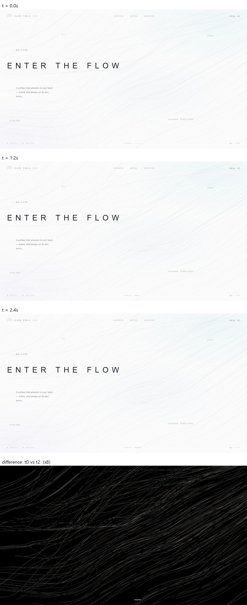
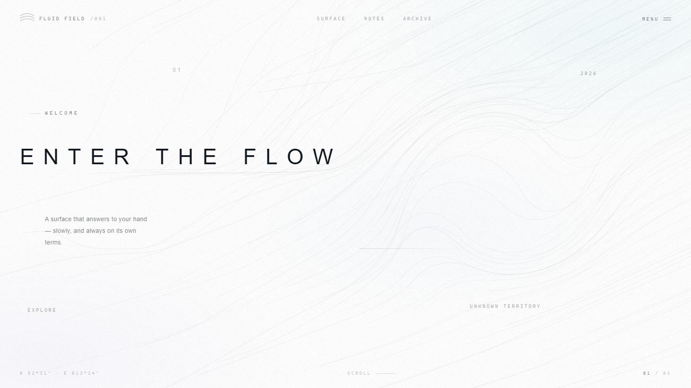
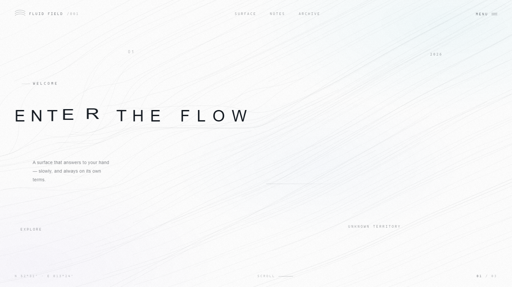
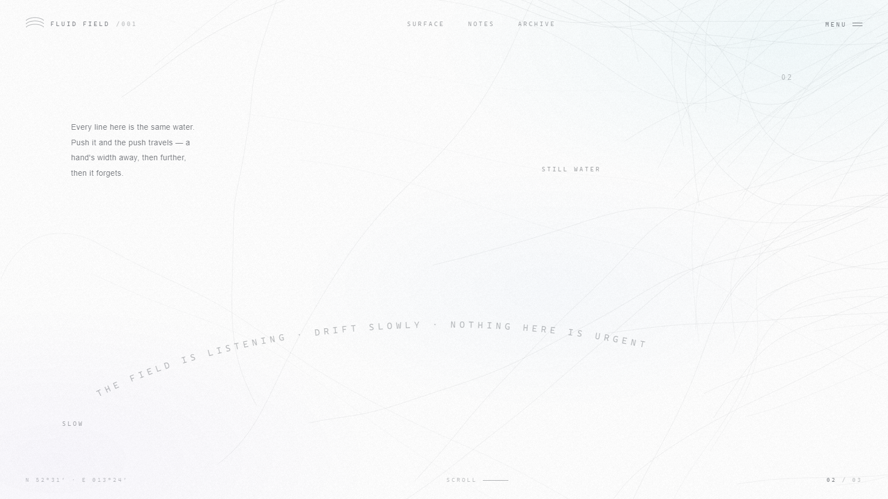
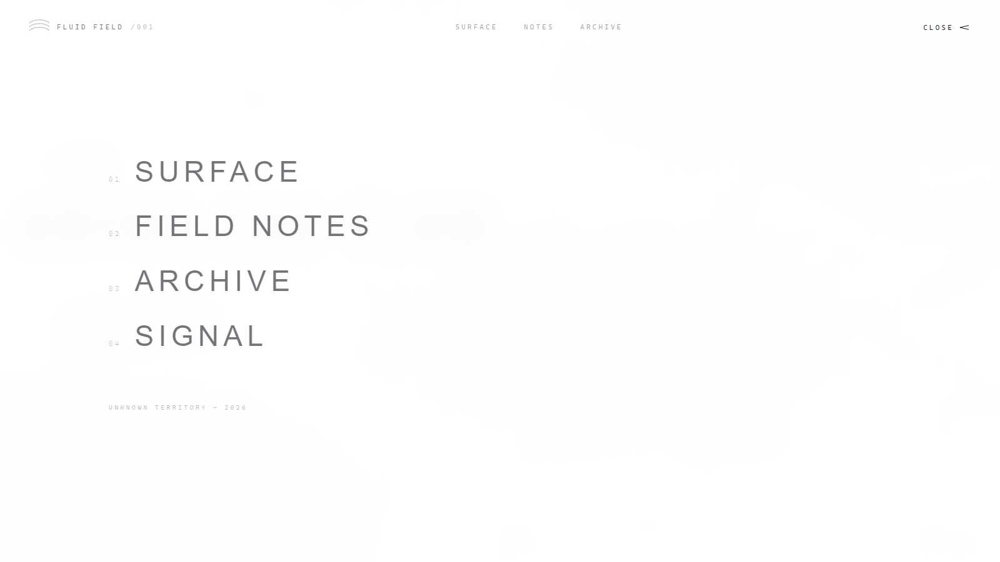
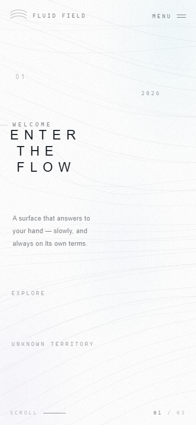

# ENTER THE FLOW — 一件会呼吸的交互式数字作品

`frontend/public/home/` 下的三个文件：`index.html` / `styles.css` / `main.js`。
**零依赖、零构建**，双击 `index.html` 就能跑，也可以放进任何项目的静态目录。

本地预览：<http://127.0.0.1:5173/index.html>（怎么起静态服务器见 README「跑起来」）


---

## 为什么是 Canvas 2D 而不是 WebGL

brief 里说「如果条件允许可以用 Three.js / WebGL」。这里刻意没用，两个原因：

1. **1px 发丝线是 WebGL 的弱项**。GL 画细线要么用 `gl.LINES`（宽度被驱动限制死、几乎必然锯齿），
   要么在片元着色器里用 `fwidth()` 做导数抗锯齿——曲线一密集就会摩尔纹。
   Canvas 2D 的 `stroke()` 有系统级抗锯齿，0.75px 的线在 hidpi 上细腻得多。
2. **连锁反应需要「每根线自己的状态」**。扰动要先影响近处的线、再延迟传到远处。
   在 GL 里这要么靠多 Pass 反馈纹理（重），要么退化成屏幕空间的假象。
   CPU 上每根线是一串有位置记忆的点，传播是物理自然发生的，不用假装。

代价是线条数量有上限（这里 94 根）。对「极简、克制」的构图来说，94 根已经足够密了。

---

## 物理模型：三层，都是慢的

### 1. 基场 —— 一个严格无散度的速度场

```
v = scale · sm(ψ) · curl(ψ) + D
```

- `ψ` 是四层八度的值噪声势场，权重**按「振幅 × 频率」配平**
  （梯度正比于振幅×频率，光看振幅会被高频层悄悄压过去）：

  | 层 | 振幅 | 频率 | 梯度贡献 | 作用 |
  |---|---|---|---|---|
  | 主方向 | 8.0 | 0.17f | 1.36 | 波长约 3 屏宽，决定流线穿过画面的走向 |
  | 蜿蜒 | 1.6 | 0.50f | 0.80 | 别让流线像尺子画的 |
  | 细节 | 0.55 | 1.3f | 0.72 | |
  | 微细节 | 0.16 | 3.1f | 0.50 | |

  主方向层占约 40% 的梯度：足以让流线是贯穿全屏的**开放曲线**，
  又不至于把画面压成同一个方向的平行线。

- `sm(ψ)` 只依赖 ψ，给速度做缓急变化。
- `scale` 是常数，由 `|∇ψ|` 的滑动均值**自校准**（手算噪声统计量太脆）。
- `D` 是常量向量，保证驻点附近不完全静止，也给每一章一个不同的主导方向。

#### 为什么每个因子都必须是现在这个形式

无散度 = 面积守恒 = 初始均匀分布的质点永远保持均匀。这是「画面不会慢慢空掉、
也不会汇成几条深色河道」的数学保证。三个因子各自守住这一点：

```
div(curl ψ) = 0                                    （旋度本身）
div(f(ψ)·curl ψ) = f'(ψ)·(curl ψ · ∇ψ) + f(ψ)·div(curl ψ)
                 = 0 + 0 = 0                       （因为 curl ψ ⊥ ∇ψ）
div(常数) = 0
```

**这里我连着踩了三次坑，值得单独说：**

1. **归一化会毁掉无散度。** 我一开始写的是 `normalize(curl ψ)` ——
   归一化不改变流线的*几何*，但会改变*散度*：`div(g/|g|) ≠ 0`。
   于是流线开始缓慢汇聚成"河道"。
2. **把方向场按比例混进来同样会毁掉它。** 为了打散"拉丝金属"的平行感，
   我混了一个角度随空间变化的方向场 `d(x,y)`，`div(d) ≠ 0`，
   掺进去整个场就不保守了。
3. **常量偏置才是安全的。** `D` 与位置无关，散度为零。
   大方向应该由**超低频的旋度层**提供，而不是混一个非旋度的方向场。

实测代价：修好之前，94 根线占用的 120px 格子从 76 塌到 46，
最挤的一格挤了 11 根，画面上就是几条深色带越拉越深、其余地方越来越空。

#### 还有一道保险

即使场是严格无散度的，仍有两个非理想来源：场随时间缓慢演化会让流线漂移靠近；
以及下面要说的 `resampleLine` 是个"滑动窗口"，不属于物质操作。
所以再加一道直接的中点软排斥（`spreadMidpoints`）：
中点近于 105px 就互相推开。平均每根线占 1.5 万 px²，天然间距约 124px，
所以只会碰到最近的邻居，最终稳定在蓝噪声式的均匀分布，不会排成网格。

### 2. 扰动场 —— 扩散与遗忘

鼠标划过的速度被**写进网格**（不是画拖尾）：

```
注入：局部漩涡 + 轻微推开，半径 155px，高斯衰减
扩散：每帧一次拉普拉斯算子   d = 0.115
衰减：pert *= exp(−0.62 · dt)
```

这两步是整个交互的灵魂：

- **扩散**让扰动向外传播。远处的线不是同时抖，而是被一点点「泡」到的，
  延迟响应是真实的物理结果，不是加了个 delay 参数。
- **衰减**大约 4 秒回到静息。手离开后场会一点点忘记，而不是「啪」地停住。

网格采样用双线性插值，最后限速 90px/s，避免局部叠加后线飞出去。

### 3. 流线 —— 平流 + 张力松弛 + 弧长重采样

每根线是一串点，按采样到的速度平流，之后做两件事：

```js
// 1) 曲率松弛：抹掉采样噪声，曲线永远顺滑
p[k] += ((p[k-1] + p[k+1]) / 2 - p[k]) * 0.03

// 2) 弧长重采样：把点重新铺匀（见下）
```

曲率松弛系数很小，不会把线拉直（试过 0.10，线会变得像尺子画的）。

初始化不撒直线再等它弯——而是**沿场积分**出稳态流线（`traceLine`），
前后各积一半。所以第一帧就是弯的，也顺便让「减少动态效果」模式
有一个漂亮的静帧可用，而不必先跑几秒动画。

整根线飘出画面 40% 以外时，先淡出、再换地方重生、再淡入。不会有硬跳。

#### 为什么必须重采样，以及为什么不能用「距离约束」

只做曲率松弛是不够的：速度大小随空间变化，流线经过沿程减速的地方，
后面的点会追上前面的点。实测 25 秒后，94 根线里有 **61 根**的相邻点间距
被压到 3.4px 以下（标称 11.5px），最极端的两点完全重合 ——
同一根线在几个像素里反复描边，`source-over` 把极淡的描边叠成**深色硬块**。
这就是用户反馈的「过了几秒会出现部分特别粗」。

第一版修法是 PBD 式的**距离约束**（把相邻点推开拉近的力）。间距修好了
（挤成团的线 61 → 0），但立刻冒出**锯齿**：施力式的约束和曲率松弛在同一帧里
互相拉扯，会激发出「逐点交替」的模态，线的边缘变得毛毛躁躁。

最终改成**弧长重采样**：沿着现有折线按等弧长插值取点。
它是**投影**而不是施力 —— 曲线形状一点没变，只改点的分布，所以不会和松弛打架。

`span` 取 `min(总长, 目标长)`：

- 线比目标长 → 只取中段，间距精确等于标称值（多出来的部分在两端被剪掉，
  视觉上就是流线沿着自己滑动，这正是「流动」该有的样子）
- 线被压缩得比目标短 → 用全长，间距等比缩小，等流场把它重新拉开

重采样是 O(M)（`seg` 指针单调前进，整趟不会退化成 O(M²)），比两遍距离约束还便宜。

---

## 渲染

- **分段上色**：每根线切成 3 段，各取所在位置的色温。
  色温来自一层大尺度噪声，只有约一半区域会被「点亮」，其余保持纯灰。
  48 级预生成调色板（灰 → 青 → 蓝 → 紫），按索引取用，每帧零字符串分配。
- **每根线一个透明度**（0.5–1.0）× 索引色自身的 alpha，制造前后层次。
- **颗粒**：运行时用 canvas 生成一张 128×128 噪点当背景纹理，
  `mix-blend-mode: multiply` + `opacity: .2`，给纯白一点纸的质地。不引外部图片。
- **色洗**：三个径向渐变（青 / 紫 / 蓝）压到 3–5% 透明度。
  只提供「白里的一点温度」，不构成渐变背景。

---

## 文字反应堆

### 字符扩散

标题每个字母一个 `<span>`。光标附近的字母被推开并横向拉伸：

```
inf  = (1 − d/R)²           R = 232
位移 = 方向 × inf × 22px
拉伸 = 1 + inf × 0.30
```

光标两侧的字母朝相反方向跑，就是「字符扩散」。

**快进慢出**：有影响时用 7/s 的速率跟手，影响消失后用 1.5/s 慢慢回弹。
这里踩过一个坑——最初写成「`inf > 上一帧` 就用快速率」，
结果鼠标停住时 `inf == prev`，被判成「离开」走了慢速率，效果永远到不了位。
正确的判据是「当前有没有影响」（`inf > 0.002`），不是「影响有没有在变大」。

### 量位置的反馈陷阱

`getBoundingClientRect()` **会把 transform 算进去**。
如果直接用它在每帧量字符位置去算距离，就会量到「已经被推开之后」的位置，
形成正反馈把字越推越远。所以 `measureText()` 会先清空所有 transform、
强制一次样式刷新、量完再恢复，只在 resize 时执行。

### 流线绕行文字

`[data-obstacle]` 元素被当作软障碍烘进基场。
用的是**到矩形的距离**而不是到中心的距离——
用中心距离的话，一个 750px 宽的标题只有正中一小块能起作用。
障碍矩形每 8 帧重测一次，所以滚动时「空洞」会跟着文字走，只是慢半拍，
读起来像场在让路。

---

## 滚动 = 换一个空间

页面高 300vh，画布 `position: fixed`，三章各自 100vh。
滚动进度被平滑（3.2/s）后映射到三个关键帧之间做 smoothstep 插值：

| | 旋转 | 噪声频率 | 速度 | 密度 | 色温 | 偏置角 / 强度 |
|---|---|---|---|---|---|---|
| 01 SURFACE | 0° | 0.00175 | ×0.95 | 100% | 0.12 | −0.30 / 0.40 |
| 02 NOTES | +30° | 0.00270 | ×1.30 | 83% | 0.62 | +0.62 / 0.52 |
| 03 ARCHIVE | −23° | 0.00210 | ×0.78 | 92% | 1.00 | −0.85 / 0.38 |

方向、疏密、形态、色温同时换档，所以翻页像进入另一个空间而不是滚动一张长图。
密度用「前 N 根线可见」实现，配合每根线自己的淡入淡出，不会突然少一片。

---

## 流动感

第一版把速度定在 19px/s，结果「慢」过头了 —— 实测虽然每 3 秒有 17% 的像素在变，
但肉眼几乎看不出在动。现在默认 **44 px/s**（章节系数 1.00 / 1.16 / 0.86 → 44 / 51 / 38），
打开就能看到流线在走，但仍然不吵。

让它「看起来在流动」而不是「形状在慢慢变」的关键有四条：

### 1. 每根线自己的速度系数（0.72 ~ 1.28）

所有线同速会像**一张贴图在整体平移**。给每根线一个固定的随机系数之后，
同一片流场里有的线先走、有的线后走，互相错开、产生滞后响应。

这不破坏无散度：常数缩放只改变沿流线的参数化，**不改变流线几何**。

### 2. 持续的整体漂移

速度场是 `scale·f(ψ)·curl(ψ) + D`，其中常量 `D` 就是净漂移。
旋度分量在大范围上互相抵消，只有 `D` 留下净矢量 —— 实测**场速度的空间矢量均值 = 15.2 px/s**，
这就是「线条整体从一侧漂向另一侧」的精确度量。

`bias`（D 占目标速度的比例）从 0.34 提到 0.50：太小时流线是闭合环（像等高线），
太大就变成平行拉丝。0.50 配上四层八度的旋度，得到的是「有主方向但仍在蜿蜒」的河流感。

### 3. 极弱的呼吸（±5%）

三个**不可通约**的周期叠加（约 30s / 47s / 72s），不是单个正弦 ——
单个正弦听得出机械节拍，三个叠起来几分钟内都不会显出重复。
幅度落在要求的 3%~7% 区间；再叠一层 ±2% 的**每线相位**呼吸，避免所有线同时胀缩。

### 4. 速度自校准（一次算准，不迭代）

`|v|` 对归一系数 `speedTrim` 是**严格线性**的（正标量乘在整条矢量上），
所以先按 trim=1 统计一遍场速度均值，直接令 `speedTrim = 目标 / 均值` 就完事。

一开始写成了「实测/目标」的迭代反馈，问题很多：环路有 20 帧延迟、增益靠试、
还会发散（实测 trim 一会儿 1.007 一会儿 1.37，流速反而掉到 34.8）。
关系既然是线性的，就不该用迭代去逼近它。

实测：目标 44 → 实测 42.8~43.7，trim 稳定在 0.69~1.01。

### 鼠标 = 手划过水面

每个 `pointermove` 往网格写一块速度，鼠标经过的路径自然留下一串逐渐衰减的注入点 ——
这就是尾迹。写进去的速度由三部分构成：

| 分量 | 参数 | 作用 |
|---|---|---|
| 沿运动方向拖水 | `mouseDrag` 0.6 | 尾迹跟着手走，不散在原地 |
| 垂直方向漩涡 | `mouseSwirl` 0.95 | 线条弯曲、错开、轻微旋转 |
| 向外推开 | `mousePush` 0.35 | 线条从手的两侧让开 |

之后完全交给场自己：拉普拉斯扩散向外传播，指数衰减让它 1~2 秒后缓慢消失。
手停下来之后没有任何持续的力，所以恢复是自然的。
推力上限从 `13 + 速度×1.55` 提到 `26 + 速度×2.4`，注入半径 155 → 175 ——
速度翻倍了，扰动不跟着放大就会显得没反应。

### 点击涟漪

圆环浓度 0.15 → 0.26（内圈 0.08 → 0.14），推力 74 → 120。
原来太淡了，点击像没反应；现在明确看得见波纹，但仍是浅灰细线，不刺眼。

---



上图是间隔 1.2 秒抓的三帧拼成的动感条，以及首末帧差异放大 8 倍。
差异图里那些白线就是**每条流线原来的位置** —— 每一根都离开了原地。

---

## 减少动态效果（prefers-reduced-motion）

**这一节很重要，因为最容易让人误以为「坏了」。**

Windows 的 *设置 → 辅助功能 → 视觉效果 → 动画效果* 关掉之后，
Chrome 会报 `prefers-reduced-motion: reduce`，作品按无障碍规范进**静帧模式**：
`requestAnimationFrame` 根本不启动，所以画面完全不动。

这是**正确行为**（用户明确要求过：只有系统明确开启减少动态效果时才允许进入静态模式），
但现象极具误导性 —— 调参台里滑杆怎么拖都没反应，所有指标冻住，看起来像面板坏了。

所以补了三件事：

1. **把判定依据摊开**。`debug().motion` 直接给出
   `{ apiSupported, systemPrefersReduce, override, reducing }`，
   一眼能看出是谁要求的。
2. **调参台顶部显式提示**，文案点明「这不是面板坏了」以及 Windows 上关掉它的确切位置，
   并附带两个按钮：**强制动态** / **跟随系统**。
3. **逃生通道**：
   - `?motion=full` 强制完整动态，`?motion=auto` 回到跟随系统
   - 调参台的开关（写进 `localStorage`，iframe 重载后仍有效）

判断本身也做了「宁动勿静」处理：`matchMedia` 不存在、抛异常、或者 `matches` 不是布尔
`true`，一律当作**正常动**。早期版本直接读 `motionQuery.matches`，
一旦这个 API 在某个环境里缺失，整页会静悄悄地停在静帧上。

静帧状态下也会**给出真实读数**（不是一片 0）：`setup()` 里做一次满网格的精确校准，
然后跑 60 次探针，所以 `实测流速 / 速度归一 / 线条数` 都是真值 ——
配合提示文案，用户能立刻分辨「停住了」和「坏了」。


---

## 从「毛发」到「水面」

速度提上去之后出现了新问题：线条像**飘动的头发**，局部弯曲和方向变化过多，整体凌乱。
不是速度的问题（速度是对的），是**流场结构**和**线条曲率**的问题。

### 量化「毛发感」

先定义可测的指标，不然改完没法判断是变好了还是只是变慢了：

- **每段折角**（度/11.5px 点距）—— 折角就是曲率×点间距，所以直接反映「弯得急不急」。
  换算成弯曲半径更直观：`R = 11.5px / 折角(rad)`。每段 2° → R≈330px（宽缓）；每段 12° → R≈55px（打卷）。
- **相邻线方向差** —— 每根线取中点切线方向，找最近的另一根线量夹角。
  头发感的特征是各走各的，这个值会很大；同一片水的特征是基本平行。

### 基线（问题有多大）

| 指标 | 3s | 60s | 目标 |
|---|---|---|---|
| 中位折角 | 0.35° | 0.61° | < 2.5° ✓ |
| **最大折角** | **18.9°** | **51.1°** | < 9° ✗ |
| **最小弯曲半径** | **35px** | **13px** | > 70px ✗ |
| 相邻线方向差 | 4.3° | 7.6° | < 12° ✓ |

中位数很好、最大值爆表 —— 说明 99% 的线是顺的，但**每条线上散布着几个发卡弯**。

### 改了什么

**1｜八度重配比。** 层的权重决定梯度方向，也就决定线条方向。
原来的四层是 `1.36 / 0.80 / 0.72 / 0.50`，**高频两层占了 21% 的梯度能量**，
波长只有 440px 和 184px —— 一条 1322px 的线上要走完 3~7 个弯曲周期。
现在改成 `1.275 / 0.630 / 0.336 / 0.130`（高频只占 6%），
主弯层波长约 3400px（两倍屏宽），一条线在整屏范围内方向只缓慢变化。

**2｜主流强度。** 常量漂移 D 相对旋度项的倍数 `bias` 从 0.50 提到 **1.55**。
合成方向偏离主方向的最大角度 = `atan(1/bias)`：0.5 → ±63°（相邻线可以一条向左一条向右），
1.55 → **±33°**（明确的集体流向，仍保留宽缓摆动）。
实测相邻线方向差从 4.1~8.5° 降到 **4.5~8.4°**，净漂移从 15.2 提到 **40.8 px/s**。

**3｜最大曲率限制。** 按折角**超出比例**加压：没超限的点只用基础系数（保留自然弯曲），
超限的点按比例放大平滑权重。固定系数松弛做不到这一点 —— 要压住 13px 半径的尖角，
系数得大到把整条线一起拉直。

### 排查过程中修掉的两个真 bug

**弦长遍历的根选择。** 段内解二次方程 `|A + t·u − prev|² = step²` 会得到两个根：

- 取**较大的根**（出口）—— 两个根都合法时会跳过一整段，在折线自我靠近处凭空造出拐角；
- 取**较小的根**（入口）但不管先后 —— 入口可能落在当前位置**之前**，
  输出点向后跳、折线开始自我折返。实测 60 秒后线长从 1322px 塌到 844px、相邻点距缩到 0.1px、挤团 4 根。

正确做法是取**「严格大于当前弧长位置」的最小根**。加了这个约束之后，
线长恒定 1322.5px、点距稳定 11.4~11.5px。

**重采样造出的重合点。** 弦长遍历在折线末端漏掉一段时会留下两个几乎重合的点，
它们的「切线方向」是 `atan2(0,0)` —— 纯数值噪声。
在对齐度体检里表现为 **180° 的假脱轨**（一度以为是场的问题，查了很久），
更实际的影响是这个假方向会喂给曲率限制器，让它去压一个不存在的拐角。
现在检测到退化就退回「沿全长均匀铺点」分支。

### 结果

| 指标 | 基线 | 现在 |
|---|---|---|
| 中位折角 | 0.21 – 0.61° | **0.07 – 0.31°** |
| 最大折角 | 12.5 – 51.1° | **5.3 – 9.6°** |
| 最小弯曲半径 | 13 – 53px | **69 – 124px** |
| 相邻线方向差 | 4.1 – 8.5° | **4.5 – 8.4°** |
| 线长 | 1310 – 1322px | **1322.5px（恒定）** |
| 点距 | 7.3 – 11.5px | **11.4 – 11.5px** |

速度没动（实测 42.4 / 目标 44），帧时间仍锁 16.67ms。

### 诊断工具

排查过程中写的三个探针都留在仓库里，以后再遇到「线条看起来不对」可以直接用：

| 脚本 | 作用 |
|---|---|
| `field-curvature-probe.mjs` | 场**本身**的固有曲率 —— 把「场的问题」和「管线的问题」分开 |
| `alignment-probe.mjs` | 线条切线方向与场方向的夹角，并抓出最脱轨那一段的现场坐标 |
| `worst-turn` 接口 | `window.__flow.worstTurn()` 直接吐出最坏折角的顶点、相邻段长、邻域坐标与场方向 |

**这三个探针的价值在于它们推翻了我的假设三次**：先以为是噪声频率太高（对，但不全是），
再以为是曲率限制器振荡（是副作用，不是根因），最后才定位到弦长遍历的根选择 ——
而中间还被「重合点造成的 180° 假脱轨」误导了很久。
**先量，再改；量出来的东西和直觉不一致时，先怀疑量具。**

---

## 性能与礼貌

| 措施 | 说明 |
|---|---|
| 滚动更新基场 | 每帧只重算 1/7 的行，消除周期性卡顿 |
| 自适应降级 | 帧时间 > 23ms 降线条数到 76%/56%，< 13.5ms 再升回来（带冷却） |
| 标签页隐藏 | 停 rAF |
| dpr 上限 2 | 高分屏不发虚，也不为 3x 屏浪费 |
| 移动端预设 | 线条 94 → 38，网格 30 → 42px，段数 3 → 2 |
| `prefers-reduced-motion` | 不出动画帧，只沿场积分出一张静帧 |
| 每帧零分配 | 颜色是预生成字符串，路径直接画进 ctx，不建临时数组 |

实测：桌面 1600×900 与移动 390×844 都稳定在 **16.67ms**（vsync 锁满），
自适应质量始终停在最高档，说明还有余量。

---

## 验证

```powershell
# 需要前端开发服务器在 5173
node tools\verify\home-check.mjs
```

19 项断言，全部通过。截图与 JSON 报告落在 `artifacts/`。

流体部分的断言不是「看起来动了」，而是真的测物理量：

```
划线前      近处 0.049   240px 外 0.013
刚划完      近处 35.03   240px 外 3.810    ← 远处从未被触碰，能量涨了 295 倍
1.7 秒后    近处  1.16   240px 外 1.023
8.2 秒后    近处  0.005  240px 外 0.005    ← 回到静息
```

扩散的判据不是「远处能量绝对升高」（划线那 1.6 秒里它就已经涨上去了），
而是**能量剖面被抹平**：`远处/近处` 从 0.109 变成 0.879。这才是扩散的特征。

### 几何体检：`node tools/verify/geometry-check.mjs`

不派发任何输入，只在中途几个时间点读 `__flow.geometry()`。
这是抓「过了几秒变粗」那类退化用的 —— 那种毛病截图看不出来，得看数值。

```
t(s) drawn cells crowded worst worstMin medianMin crushed
3    94    83    11      3     10.998   11.499    0
25   94    76    18      3     10.839   11.498    0
60   94    82    12      2      8.816   10.852    0
```

- `crushed`＝最短相邻间距 < 0.3×标称值的线数。**修复前**：3s 时 23 根，25s 时 61 根。
  现在**全程 0**。
- `cells`＝被线中点占用的 120px 格子数。修复前从 76 一路塌到 46（汇成河道）；
  现在 83 → 82，基本不降。
- 判定基准不是 t=3s 的初始值 —— 初始撒点用的是抖动网格，比随机更均匀，
  无散度流会把这份"人为的均匀"剪切掉一点，那不算退化。
  真正的基准是**均匀随机的期望占用格数** `E = bins·(1−(1−1/bins)^n) ≈ 64`。

### 流动感验收：`node tools/verify/motion-check.mjs`

验收标准是「用户第一次打开，盯 1~2 秒就能明显判断这些线正在流动」。
这句话必须能测，所以量三件事（13 项断言全绿）：

| 量 | 方法 | 实测 |
|---|---|---|
| 实测流速 | 画面撒 8×6 探针，逐帧量场速度取均值 | **42.8**（目标 44） |
| 整体漂移 | 场速度的**空间矢量均值**（旋度项大范围抵消，只剩 D） | **15.2 px/s** |
| 局部在动 | 四处区块全分辨率互相关，最优平移是否显著优于零位移 | **4/4 与 3/4 判定为动** |
| 观感变化 | 1 秒帧间变化像素占比 | **20.2%** |
| 持续性 | 5 秒内新增帧数 | **301 帧**，状态 running |
| 呼吸 | 20 次采样瞬时值 | 0.956 ~ 1.025（幅度配置 0.05） |
| reduced motion | 同上测量 | **变化像素 0.000** |

**测量本身踩过的坑**（不修这些，量出来的数字全是错的）：

1. **降采样到 200 宽 = 混叠**。线条间距只有 11.5px，8 倍降采样后变成 1.4px，
   远在奈奎斯特频率以下，指纹基本是噪声 —— 于是「3 秒的变化量」反而比「1 秒」还小。
   必须用全分辨率区块。
2. **准周期图案的互相关会锁到错误周期**。间距 11.5px，位移一旦超过半个间距就混叠，
   长窗口实测能给出 83px/s 这种明显假匹配。搜索半径必须 **小于半个线距**。
3. **整数像素量化**。60ms 窗口下 1px 就是 16px/s 的台阶，测出来全是 33.3 / 50 / 66.7。
   加抛物线亚像素拟合才能得到连续值。
4. **固定 1 秒的变化量受时间混叠影响**，同一份代码能跳出 14%~26%。
   取邻近三个窗口（880/1000/1120ms）的均值把相位依赖平均掉。
5. **整体漂移不该用图像相关去猜**。旋度项在大范围上抵消，场速度的矢量均值就是漂移，
   精确且免费 —— 加进 `debug().drift` 之后这项断言才稳。

### 背景是不是静态的：`node tools/verify/background-check.mjs`

全程零输入，只比 canvas 的 alpha 指纹：

| | 逐像素平均差 | 变化像素占比 |
|---|---|---|
| 正常模式 0s → 3s | 1.54 | **20.6%** |
| 正常模式 3s → 6s | 1.62 | **20.8%** |
| `prefers-reduced-motion: reduce` | **0.000** | **0%** |






